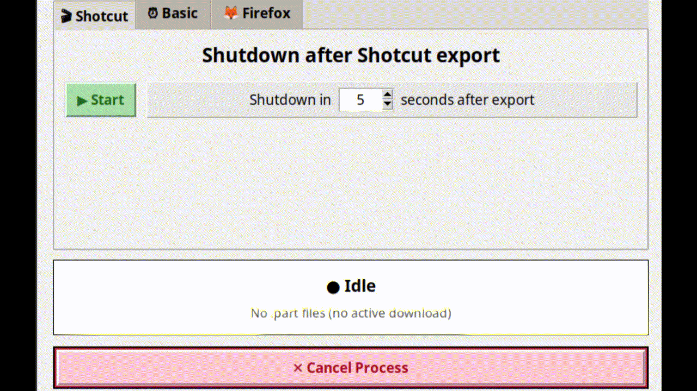

# 🖥️ Smart Shutdown Timer

A lightweight Python GUI tool that monitors **Shotcut exports**, **Firefox downloads**, or a **basic countdown** – and shuts down your PC when the task finishes.



---

## ✨ Features

| Tab | What it does |
|-----|--------------|
| **🎬 Shotcut** | Detects `melt` processes (Shotcut's render engine). Shows progress & ETA. Shuts down after export finishes. |
| **⏰ Basic** | Simple countdown timer – set hours and minutes. |
| **🦊 Firefox** | Watches for `.part` download files. Skips stalled downloads. Shuts down after all downloads complete. |
| **Global Cancel** | Stops any running process immediately – no matter which tab. |


---

## 📋 Requirements

- **OS:** Linux (Mint / Ubuntu / Debian / Xfce, GNOME, etc.)
- **Python:** 3.8 or newer
- **Shotcut:** any version (for the Shotcut tab)
- **Python packages:** `psutil`, `tkinter` (built-in)

---

## 🚀 Installation

### 1. Install dependencies

```bash
sudo apt update
sudo apt install python3-pip python3-tk
pip install --break-system-packages psutil
