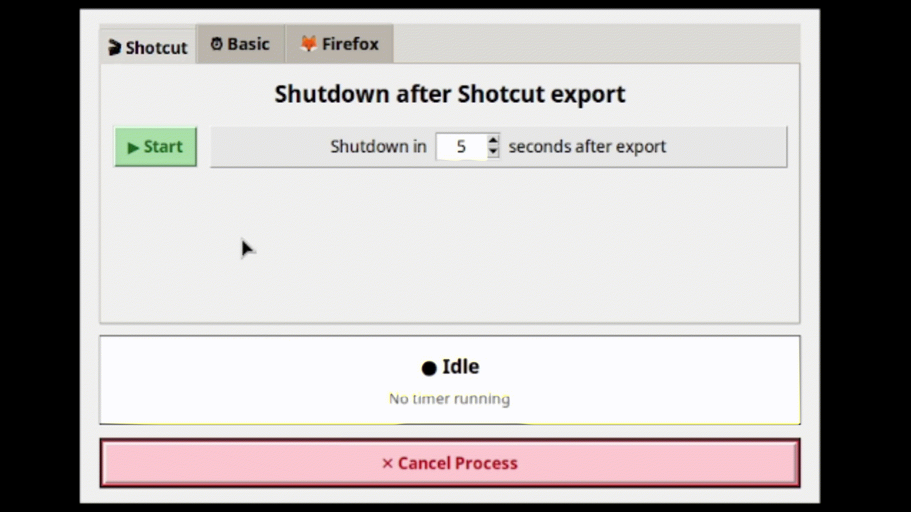

# 🖥️ Smart Shutdown Timer

A lightweight Python GUI tool that monitors **Shotcut exports**, **Firefox downloads**, or a **basic countdown** – and shuts down your PC when the task finishes.



---

## ✨ Features

| Tab | What it does |
|-----|--------------|
| **🎬 Shotcut** | Detects `melt` processes (Shotcut's render engine). Shows progress. Handles queued exports. Shuts down after all exports. |
| **⏰ Basic** | Simple countdown timer – set hours and minutes. |
| **🦊 Firefox** | Watches for `.part` download files. Skips stalled downloads. Shuts down after all downloads complete. |
| **🔊 Audio** | Monitors audio playing. Shuts down after audio stops. Proper before sleep movies,music etc. |
| **Cancel** | Stops any running process immediately – no matter which tab. |

---

## 📋 Requirements

- **OS:** Linux (Mint / Ubuntu / Debian / Xfce, GNOME, etc.)
- **Python:** 3.8 or newer
- **Shotcut:** any version (for the Shotcut tab)
- **Python packages:** `psutil`, `tkinter` (built-in)

---

## 💻 Compatibility

| Component | Tested version(s) |
|-----------|-------------------|
| **Linux Mint** | 22.2 Zara (Xfce) – main test environment |
| **Ubuntu / Debian** | Should work on 24.04 (Noble) and Debian 12+ – not fully tested |
| **Python** | 3.12 (but should work on 3.8+) |
| **Shotcut** | 26.8.1 and later – any version using `melt -progress2` |
| **Firefox** | Any modern version (tested with v130+) |

> ⚠️ **Windows / macOS:** This script is designed for Linux only. It has not been tested on other operating systems. The shutdown command (`shutdown -h now`) and process detection may not work on non-Linux platforms.

---

## 🚀 Installation

### 1. Install dependencies

```bash
sudo apt update
sudo apt install python3-pip python3-tk
pip install --break-system-packages psutil
```
